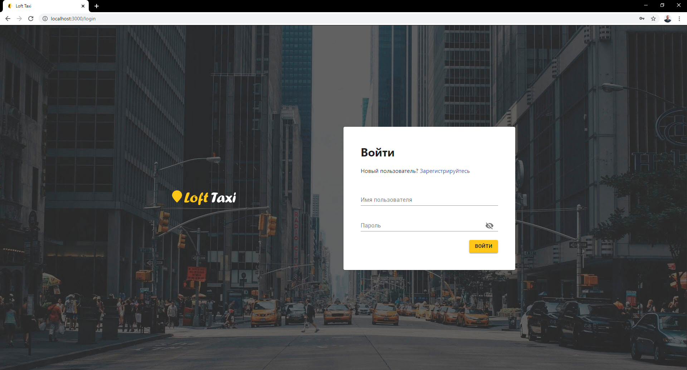
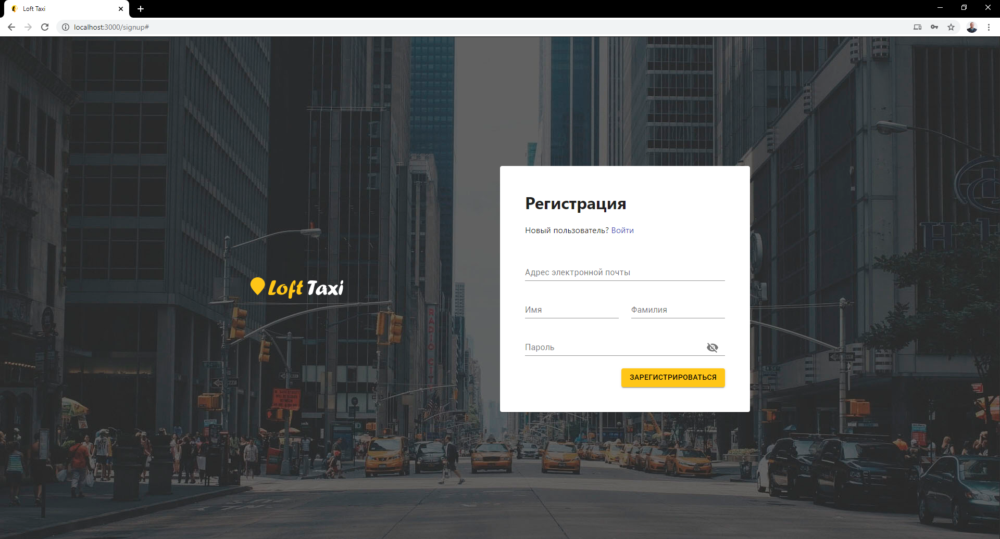
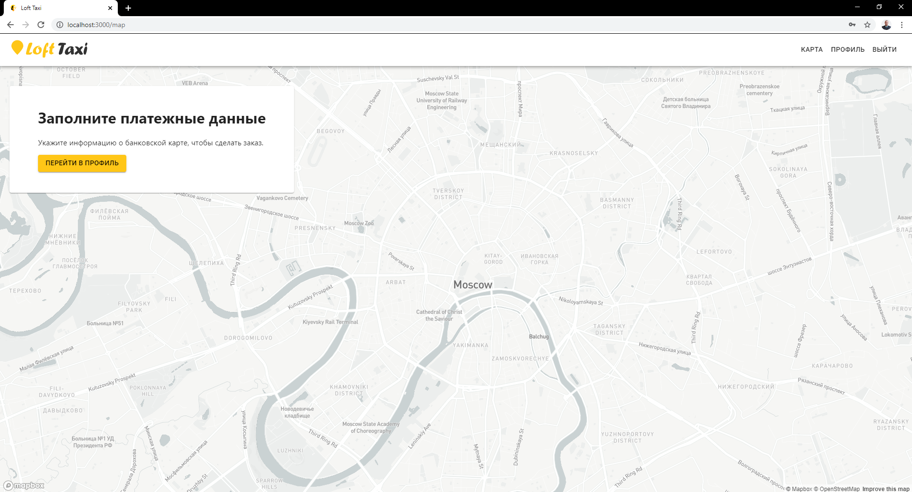
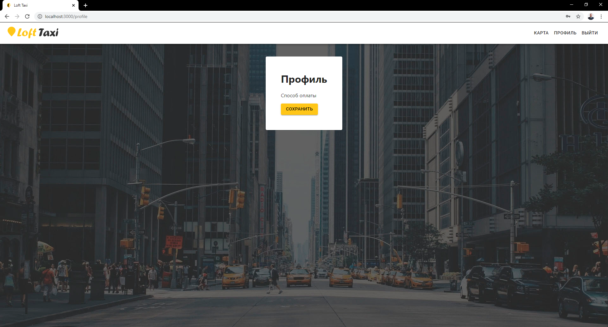

# Неделя #1

## Домашнее задание, ТЗ №1:

1. Приложение создано при помощи [Create React App](https://github.com/facebook/create-react-app).

2. Добавлены компоненты, в черновом варианте сверстаны формы следующих страниц: логин, регистрация, карта, профиль _(скриншоты страниц приведены ниже)_.

3. Для верстки были установлены npm пакеты [@material-ui](https://github.com/mui-org/material-ui) и [node-sass](https://github.com/sass/node-sass).

4. Навигация реализована при помощи стейта. При сабмите формы логина пользователь попадает на страницу с картой.

5. Установлен [mapbox](https://github.com/mapbox/mapbox-gl-js), карта выведена в соответствующей компоненте.

6. Настроен [commitizen](https://github.com/commitizen/cz-cli).

## Cкриншоты:

_Страница “Логин”_ 

_Страница “Регистрация”_ 

_Страница “Карта”_ 

_Страница “Профиль”_ 

## Домашние задания:

1. [Неделя #1](./docs/Homework__01.md) ТЗ №1
2. [Неделя #2](./docs/Homework__02.md) ТЗ №2
3. [Неделя #3](./docs/Homework__03.md) ТЗ №3
4. [Неделя #4](../README.md) ТЗ №4

## Доступные скрипты:

Для запуска в каталоге проекта выполняем команду:

### `npm start`

Запускает приложение в режиме разработки. 
Откройте [http://localhost:3000](http://localhost:3000), чтобы просмотреть его в браузере.

### `npm run build`

Собирает приложение в папке `build`.
